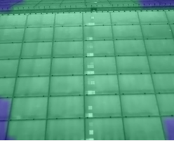
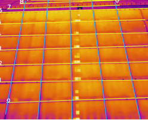
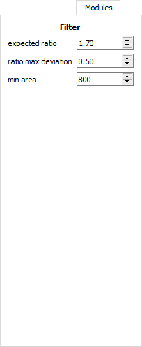

This repository contains the implementation of a feasibility study for
automatic detection of defected solar panel modules. The developed
framework has been coined *Thermography* due to the fact that the input
data to the system is a sequence of images in the infrared spectrum.

.. figure:: _static/example-view.gif
   :alt: Thermography in action

   Thermography in action

Structure
~~~~~~~~~

The repository is structured as follows:

   1. `Documentation <docs>`__ of the *Thermography* repository.
   2. `GUI <gui>`__ source code associated to the graphical user interface for interacting with the *Thermography* framework.
   3. `Log files <logs>`__ generated at runtime.
   4. `Resources <resources>`__ used by the *Thermography* framework.
   5. `Thermography <thermography>`__ core source code related to detection and classification of solar panel modules.

The *python* scripts located in the root directory can be used to launch
different executables which exploit the *Thermography* framework for
solar panel module detection and classification.

Installation
~~~~~~~~~~~~
*Thermography* has been tested using the 64-bit version of *python 3.5*.
If you are using an other version of python, consider installing and using *Thermography* inside a virtual environment.

System-wide installation
''''''''''''''''''''''''
Here follow the steps to install *Thermography* system-wide.

**Get the source**

Download the git repository:

.. code:: bash

    $ git clone https://github.com/cdeldon/thermography.git
    $ cd thermography/

Or download the following `zip <https://github.com/cdeldon/thermography/archive/master.zip>`__.

**Prerequisites**

Install the prerequisites:

.. code:: bash

    $ pip install -r requirements.txt

Anaconda
''''''''
Here follow the steps to install *Thermography* in a virtual environment created using `Anaconda <https://www.anaconda.com/download/>`__.

**Get the source**

Download the git repository:

.. code:: bash

    $ git clone https://github.com/cdeldon/thermography.git
    $ cd thermography/

Or download the following `zip <https://github.com/cdeldon/thermography/archive/master.zip>`__.

**Virtual environment**

Create a new virtual environment

.. code:: bash

   $ conda create --name my_env python=3.5
   $ activate my_env

**Prerequisites**

Install the prerequisites:

.. code:: bash

    (my_env) $ pip install -r requirements.txt

Example scripts
~~~~~~~~~~~~~~~

Here follows a description of the example scripts in the `root <.>`__
directory of the *Thermography* repository.

Application
'''''''''''

Running the `main\_app.py <main_app.py>`__ script a default video is
loaded and each frame is processed for module extraction. This script's
purpose is to show the workflow of the *Thermography* framework for a
simple video.

GUIs
''''

A graphical user interface is provided for interacting with the *Thermography* framework. In particular the following executables are available:

   1. `Dataset creation <main_create_dataset.py>`__ script used to facilitate the creation of a labeled dataset of images representing solar panel modules.
   2. `ThermoGUI <main_thermogui.py>`__ graphical interface which allows the used to interact with the *Thermography* framework and to analyze a new sequence of frames on the fly.

The executables with a graphical interface offer the following tools and
visualizations: |GUI|

The GUI presents different views of the processed input video, in
particular the following views are available:

+-----------------+-----------------+
| Attention image | Edge image      |
+=================+=================+
| |AtteImage|     | |EdgeImage|     |
+-----------------+-----------------+

+-----------------+-------------------+
| Segment image   | Rectangle image   |
+=================+===================+
| |SegmImage|     | |RectImage|       |
+-----------------+-------------------+

The lateral toolbar offers runtime parameter tuning with immediate
application:

+--------------+--------------+--------------+--------------+
| Video tab    | Prepr. tab   | Segment tab  | Modules tab  |
+==============+==============+==============+==============+
| |VideoTab|   | |PreprTab|   | |SegmeTab|   | |ModulTab|   |
+--------------+--------------+--------------+--------------+

Training and restoring
''''''''''''''''''''''

Executables for training and restoring a learning system are offered
with the *Thermography* framework. These scripts can be used and adapted
for training a new classifier which can the be integrated with the GUIs
for real time classification of the detected solar panel modules.

1. `Training <main_training.py>`__ trains a model to classify input
   images with the correct label.
2. `Restoring <main_training_restorer.py>`__ restores a trained model
   with associated weights and outputs the classification for a set of
   input images. ### Tests The base functionalities of the
   *Thermography* framework are tested using
   `unittests <https://docs.python.org/3/library/unittest.html>`__. The
   tests can be executed as follows:

   .. code:: bash

       $ cd thermography/
       $ python -m unittest discover thermography/test [-v]

The same tests can be run as a normal python script as follows:

.. code:: bash

    $ cd thermography/
    $ python main_test.py

.. |GUI| image:: _static/gui_video.PNG

.. |EdgeImage| image:: _static/edge_image.PNG

.. |RectImage| image:: _static/rectangle_image.PNG
.. |VideoTab| image:: _static/video_tab.PNG
.. |PreprTab| image:: _static/preprocessing_tab.PNG
.. |SegmeTab| image:: _static/segments_tab.PNG

